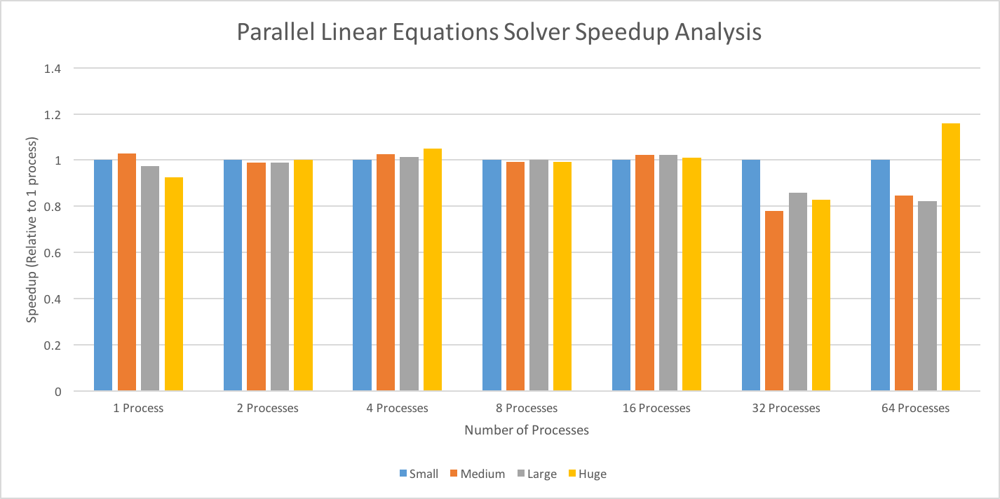

# Project Conclusions

## The graphs
The speedup due to process count is shown in the graph below:

Where we define speedup per Dr.Zahran as:

This speedup graph was derived from the averages of the time required shown in the graph below,
and taken from a sample size of 5 runs per each set, with the full data available for viewing [here](Aggregate Output.xlsx).

## The "Why"
As we can see per the trendline in the runtime graph, as the number of processes increases, 
we can see an increase in the time taken to complete the program, as process creation, 
processing, commnication, and termination results in an overhead for the program that 
thus causes it to slow as the number of processes increases.

Another trend to see is that by holding the number of processes frozen, and increasing the size
of the datasets given, the time required to complete is around the same, with a few instances
of being faster than the smaller inputs. A possibility for why this is so is because the "huge" dataset
given to us is still actually small (comparatively speaking), and cannot thus overcome the effects of
the overhead generated by the overhead inherent in parallel systems.
