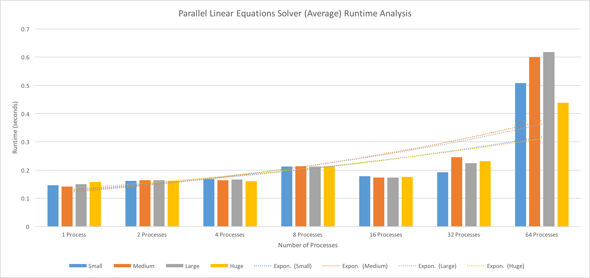
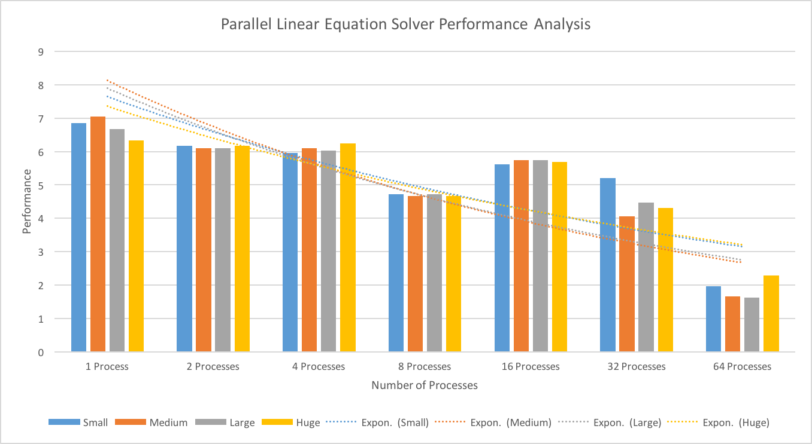

# Project Conclusions

## The graphs
The speedup due to process count is shown in the graph below:

Where we define speedup per Dr.Zahran as:

This speedup graph was derived from the averages of the time required to execute fully, 
shown in the graph below, and taken from a sample size of 5 runs per each set, 
with the full data available for viewing [here](Aggregate Output.xlsx).

We define the performance of an executing program per Dr.Zahran's definition as:

From this definition, the following performance graph was derived from the full data set linked above:

## The "Why"
As we can see per the trendline in the runtime graph, as the number of processes increases, 
an increase in the time taken to complete the program is noticed, as process creation, 
processing, commnication, and termination results in an overhead for the program that hinders
performance as the number of processes continues to increases.

A secondary trend to notice is by holding the number of processes frozen, and increasing the size
of the datasets given, the runtimegraph shows that the time required to complete is around the same, 
with some small variation that could be attributed to external factors (OS being over/under stressed 
during different sampling points, exhaustion of memory from other programs, etc. etc.). A possible 
reason for this may be because the "huge" dataset given to us is still actually small 
(comparatively speaking), and cannot thus overcome the effects of the overhead inherent in parallel systems.

A third trend that is readily apparent is the performance of each data set as the number of processes
increases. From the performance graph above, as the number of processes increases, the performance of 
processing that input decreases, quite likely due to the overhead reasons mentioned above. Something 
interesting to note is that the performance decrease is quite similar for all inputs, despite the 
differences in input size. This could possibly be explained by the fact that the relative input sizes
are quite similar, and with a larger input data set, we could determine if this trend continues.
